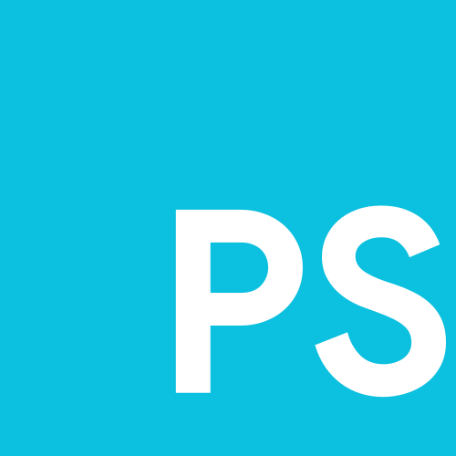

<p align="center">
  
</p>

<h1 align="center">Contributing to ProperScript</h1>

<p align="center">
  <a href="https://badge.fury.io/js/properscript"></a><br>
  <strong>Help make JavaScript more proper!</strong><br>
  We welcome contributions of all kinds.
</p>

---

## 🚀 Quick Start

### 1. Fork and Clone
```bash
git clone https://github.com/YOUR_USERNAME/properscript.git
cd properscript
```

### 2. Install Dependencies
```bash
npm install
```

### 3. Test Your Changes
```bash
# Run the compiler
node bin/cli.cjs compile examples/hello.ps

# Run the compiled output
node examples/hello.js
```

## 📝 How to Add a New Keyword

Adding a keyword requires updating **3 files**:

### Step 1: Update the Compiler Mappings

**Edit `lib/mappings.cjs`:**
```javascript
const KEYWORDS = {
  // ... existing keywords
  'yourKeyword': 'jsEquivalent',  // Add your new keyword here
};
```

### Step 2: Update VS Code Syntax Highlighting

**Edit `vscode-properscript/syntaxes/properscript.tmLanguage.json`:**

Add your keyword to the appropriate pattern group:
```json
{
  "name": "keyword.control.properscript",
  "match": "\\b(whether|period|yourKeyword)\\b"  // Add here
}
```

### Step 3: Update VS Code Autocomplete

**Edit `vscode-properscript/extension.cjs`:**

Add your keyword to the `KEYWORDS` object:
```javascript
const KEYWORDS = {
  // ... existing keywords
  'yourKeyword': 'jsEquivalent',
};
```

And update the `getCompletionKind()` function if needed:
```javascript
function getCompletionKind(keyword) {
  const categories = {
    controlFlow: ['whether', 'period', 'yourKeyword'],  // Add to appropriate category
    // ...
  };
  // ...
}
```

### Step 4: Update Documentation

**Edit `README.md`:**

Add your keyword to the syntax table:
```markdown
| ProperScript | JavaScript | Description |
|--------------|------------|-------------|
| `yourKeyword` | `jsEquivalent` | Description here |
```

### Step 5: Add an Example

Create or update a file in `examples/` showing your new keyword in action.

## 🧪 Testing Your Changes

### Test the Compiler
```bash
# Create a test file
echo 'yourKeyword test;' > test.ps

# Compile it
node bin/cli.cjs compile test.ps

# Check the output
cat test.js
```

### Test the VS Code Extension

1. Open `vscode-properscript` folder in VS Code
2. Press **F5** to launch Extension Development Host
3. Create a `.ps` file and test:
   - Syntax highlighting works
   - Autocomplete shows your keyword
   - Keyword has the right icon

## 📋 Contribution Checklist

Before submitting a pull request, make sure:

- [ ] Added keyword to `lib/mappings.cjs`
- [ ] Updated `vscode-properscript/syntaxes/properscript.tmLanguage.json`
- [ ] Updated `vscode-properscript/extension.js`
- [ ] Updated `README.md` keyword table
- [ ] Added example usage to `examples/`
- [ ] Tested compiler output
- [ ] Tested VS Code extension
- [ ] Followed existing code style
- [ ] Wrote clear commit messages

## 🎨 Code Style

- Use consistent indentation (4 spaces)
- Follow existing naming conventions
- Keep keywords British/polite themed
- Write clear, descriptive commit messages

## 💡 Ideas for Contributions

Not sure what to contribute? Here are some ideas:

- **New keywords**: Suggest British/polite alternatives for JS keywords
- **Better error messages**: Make compilation errors more helpful
- **Documentation**: Improve README, add tutorials
- **Examples**: Create example programs showing ProperScript features
- **Bug fixes**: Check the issues page
- **Performance**: Optimize the transpiler
- **Features**: Source maps, watch mode, better CLI

## 🐛 Reporting Bugs

Found a bug? Please open an issue with:

1. **Description**: What happened vs what you expected
2. **Steps to reproduce**: How to trigger the bug
3. **Environment**: OS, Node version, ProperScript version
4. **Code sample**: Minimal `.ps` file that reproduces the issue

## 💬 Questions?

- Open a [Discussion](https://github.com/ingStudiosOfficial/properscript/discussions)
- Check existing [Issues](https://github.com/ingStudiosOfficial/properscript/issues)
- Read the [README](README.md)

## 📜 License

By contributing, you agree that your contributions will be licensed under the Apache-2.0 License.

---

<p align="center">
  <sub>Keep calm and code proper 🫖</sub>
</p>
